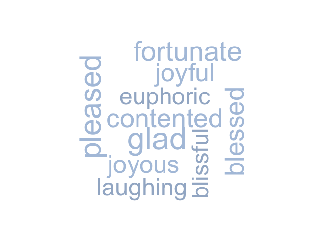

<!-- README.md is generated from README.Rmd. Please edit that file -->
rhymer
======

[](https://travis-ci.org/nlandesberg/rhymer) [](https://codecov.io/github/landesbergn/rhymer?branch=master)

### Overview

The goal of rhymer is to get rhyming and other related words through the [Datamuse API](http://www.datamuse.com/api/). This package includes basic functions to get rhymes and other similar words based on meaning, spelling, or sound. Some functions return a 'score', which can be used to rank results, but otherwise has no interpretable meaning.

Installation
------------

You can install rhymer from GitHub with:

``` r
# install.packages("devtools")
devtools::install_github("landesbergn/rhymer")
```

Example
-------

They say nothing rhymes with *orange*...

``` r
get_rhyme("orange")
#> Warning in strptime(x, fmt, tz = "GMT"): unknown timezone 'zone/tz/2017c.
#> 1.0/zoneinfo/America/New_York'
#>         word score numSyllables
#> 1 door hinge    74            2
```

Feeling down? How about this word cloud of words with similar meaning to "happy":

``` r
word_data <- get_means_like("happy")
wordcloud::wordcloud(words = word_data$word, 
                     freq = word_data$score, 
                     colors = c("lightsteelblue1","lightsteelblue2","lightsteelblue3","lightsteelblue"))
```



Main functions
--------------

`rhymer` has 4 main functions that allow you to get data on related words through the Datamuse API.

They are:

-   `get_rhyme` - a function to get rhyming words
-   `get_means_like` - a function to get words with similar meaning
-   `get_sounds_like` - a function to get words that sound similar
-   `get_spelled_like` - a function to get words that are spelled similarly

There is also a more flexible function `get_other_related` that allows you to use the API to get data on other related words using a series of 'codes' described on the [Datamuse API website](http://www.datamuse.com/api/).
